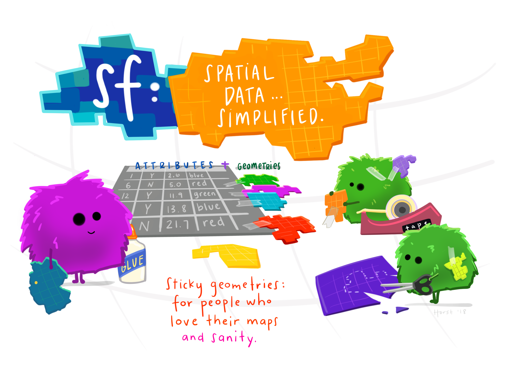

# EDS 223: Geospatial Analysis & Remote Sensing

<em>Artwork by <a href="https://allisonhorst.com/">Allison Horst</a></em>

## Course Description
This course introduces the spatial modeling and analytic techniques of geographic information science to data science students. The emphasis is on deep understanding of spatial data models and the analytic operations they enable. Recognizing remotely sensed data as a key data type within environmental data science, this course will also introduce fundamental concepts and applications of remote sensing. In addition to this theoretical background, students will become familiar with libraries, packages, and APIs that support spatial analysis in R.

## Report a bug / issue
Found something that doesn't look quite right? Feel free to file an [issue](https://github.com/eds-221-programming-essentials/EDS-221-programming-essentials.github.io) and include a concise, clear description, along with a link to the location on the website. Screenshots are always appreciated as well!
