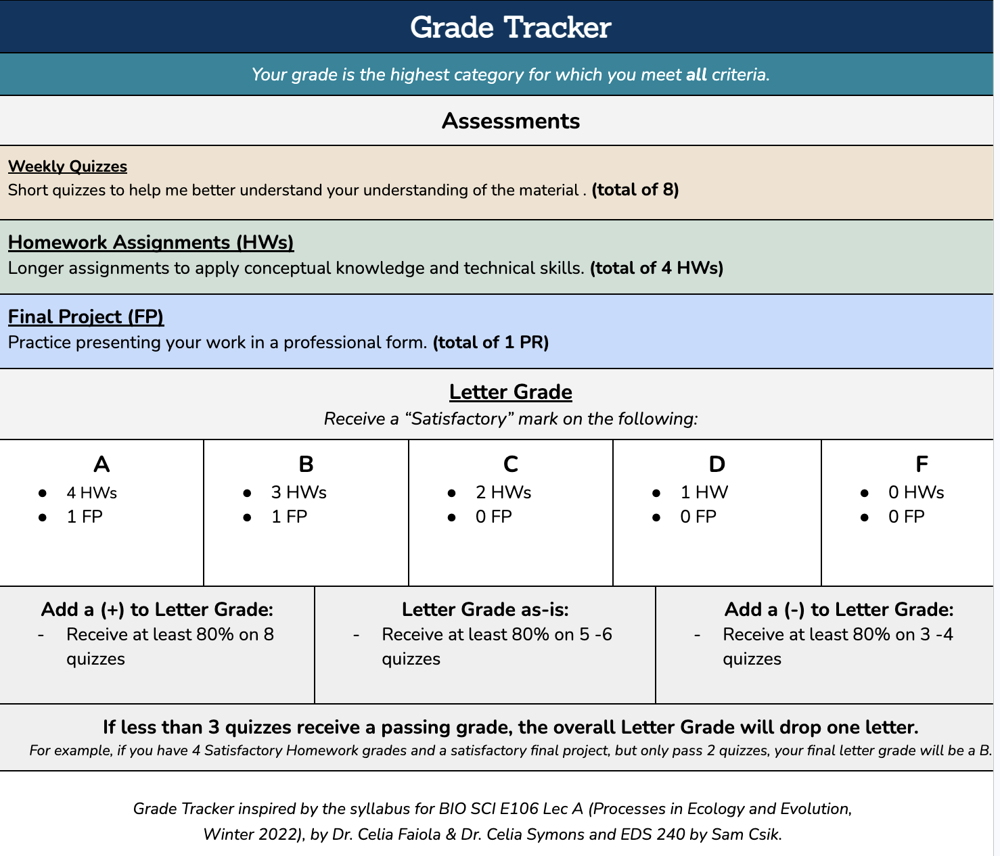
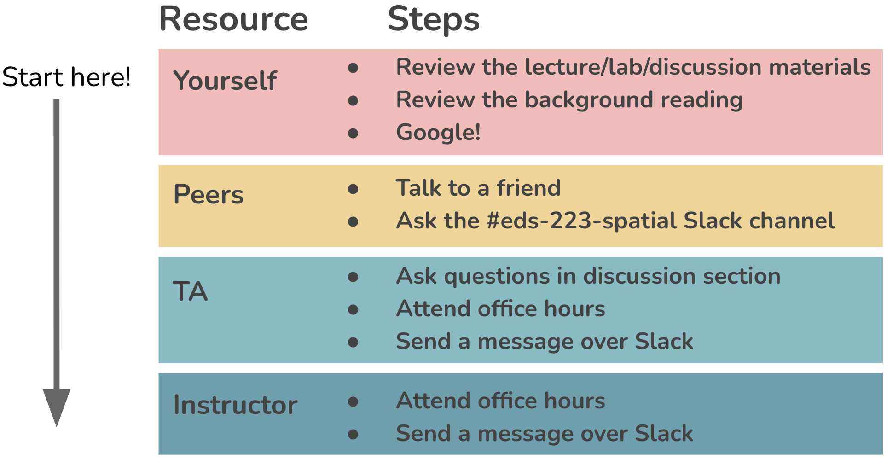

## Calendar

:::{.callout-important icon=true}
## Important
All assignments are **due at 11:59 PM** on the date listed. Homework Assignments (HWs) and Self-reflections (SRs) are always **due on Saturdays** to ensure that you have at least one day a week with no course obligations.
:::

<iframe src="https://calendar.google.com/calendar/embed?src=c_1c91a81305db0b8e0fde62774ecac44a07cee7cb78876aa3da6ff61047873884%40group.calendar.google.com&ctz=America%2FLos_Angeles" style="border: 0" width="800" height="600" frameborder="0" scrolling="no"></iframe>


## Assignments
:::{.callout-important icon=true}
Earning "Satisfactory"/ "Almost"/ "Not Yet" marks on Self-reflections (SRs), Homework Assignments (HWs), and the Portfolio Repository (PR) will determine your letter grade (e.g. A, B, etc.) for this course. See Grader Tracker below.
:::

Links to assignments will become available as they are assigned.

| Assignment Type | Assignment Title                                         | Date Assigned | Date Due   |
|-----------------|----------------------------------------------------------|---------------|------------|
| SR              | [Pre-course Self Reflection (SR#1)](assignments/SR1.qmd){target="_blank"} | 09/24/2026    | 09/26/2026 |
| HW              | [Homework Assignment #1](assignments/HW1.qmd){target="_blank"}            | 10/01/2026    | 10/10/2026 |
| HW              | [Homework Assignment #2](assignments/HW2.qmd){target="_blank"}            | 10/15/2026    | 10/24/2026 |
| HW              | [Homework Assignment #3](assignments/HW3.qmd){target="_blank"}            | 10/29/2026    | 11/07/2026 |
| SR              | [Mid Quarter Self Reflection (SR#2)](assignments/SR2.qmd){target="_blank"}            | 10/28/2026    |     11/01/2026 |
| HW              | [Homework Assignment #4](assignments/HW4.qmd){target="_blank"}            | 11/12/2026    | 11/21/2026 |
| PR              | [Portfolio Repository](assignments/PR.qmd){target="_blank"}               | 11/12/2026    | 12/02/2026 |    |


## Grade Tracker 

Use the Grade Tracker, below, to determine your course grade:

```{r}
#| echo: false
#| fig-align: "center"
#| out-width: "55%" 
#| fig-alt: "The Grade Tracker table, which can be used to determine an individual's course grade based on the number of 'Satisfactory' assignments completed, as well as descriptions on how to earn and use tokens"

```

[Redeem tokens](https://script.google.com/a/macros/ucsb.edu/s/AKfycbxg517S3NoG8CT51pdz5xHVshhgHX3vKrTQnKJu6GU/dev) to revise / resubmit an assignment that received an "Almost" or "Not Yet" mark after your first resubmission.

## Rubric

Each Homework Assignment (HWs) will include an individual rubric. However, to earn a "Satisfactory" assignments must adhere to best practices for producing professional output. Below are examples of professional and unprofessional outputs for guidance. 

Examples of Professional Output:

- [Good Example](course-materials/resources/good-bad-example/good_example.qmd){target="_blank"} with [sourced functions](course-materials/resources/good-bad-example/functions.R){target="_blank"}
- [Bad Example](course-materials/resources/good-bad-example/bad_example.qmd){target="_blank"}

## Getting unstuck

### Where to find help
Being a great data scientist isn't about writing perfect code; it's about learning how to teach yourself and when to ask for help. The only way to get better at this process is to practice by taking the time to troubleshoot on our own, so you should always plan to start there! The graphic below shows the order in which you should approach different resources for help:

```{r}
#| echo: false
#| fig-align: "center"
#| out-width: "80%" 

```

### Roadblock checklist
If you hit a roadblock, run through this checklist to make sure you've done your due diligence before bringing your question(s) to a peer, TA, or instructor.

- [ ] **revisit the course materials** - your question may already be answered in the slides, textbook, or discussion section materials
- [ ] **read the documentation** - you can do so directly from RStudio by typing `?function_name` in the console
- [ ] **read the package's vignette, if available** - these are often linked on CRAN under the *Documents* sections (e.g. see [`{dplyr}` on CRAN](https://cran.r-project.org/web/packages/dplyr/index.html)) or can be found through the command `vignette(package = "package-name")` and `vignette("vignette-name")`
- [ ] **try Googling!** - don't forget to look back at our suggested troubleshooting and Googling tips ([Teach Me How to Google](https://ucsb-meds.github.io/teach-me-how-to-google/#1))

### How to ask questions
When you decide to ask a question to a peer, TA, or instructor be sure to:

- **Provide context.** For example, "I'm trying to do this..." or "I'm working on the task where we do this..."
- **Share the specific challenge.** "I'm specifically trying to [insert function / package] to do this thing."
- **Share what happens and what you've learned.** "I repeatedly get an error message that says [this]. I've tried [this] and [this]"
- **Show your code** ideally with a [reprex](https://reprex.tidyverse.org/) that they can run / test.
- **Value and expect the Socratic method,** especially in classes and workshops -- our goal is to provide critical thinking that is transferable, not just to provide a quick fix for a single error.


