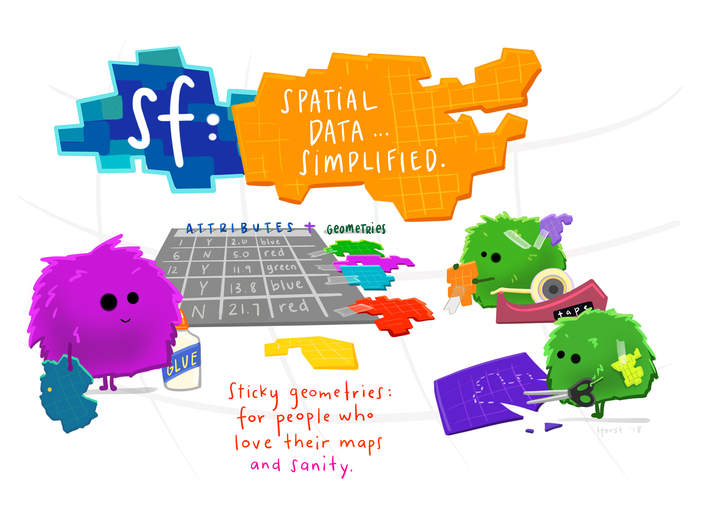
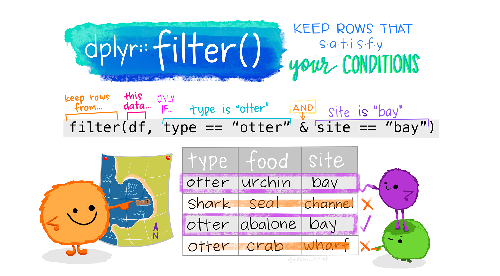
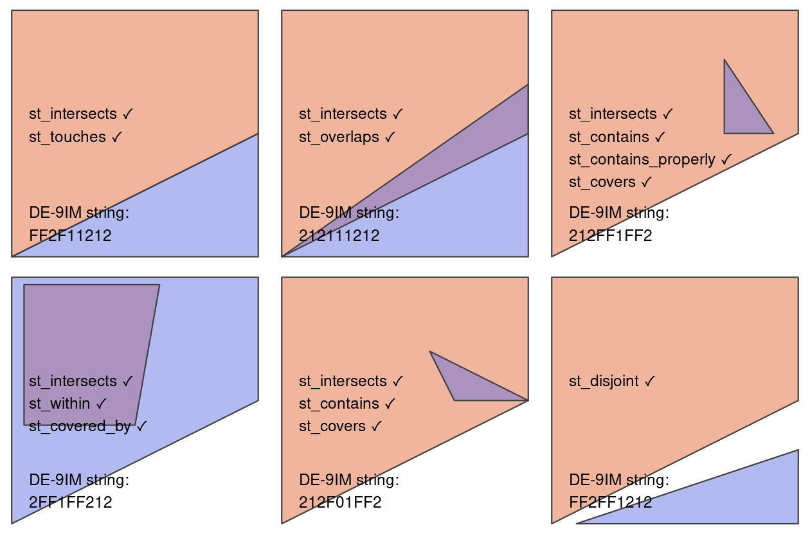
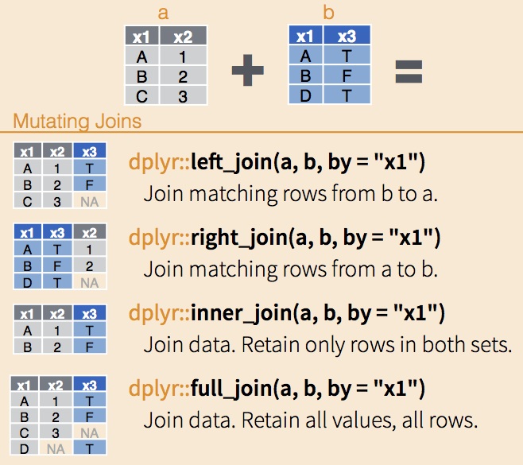

```{r}
#| eval: true
#| echo: false
#| out-width: "80%"
#| fig-align: "center"

```

::: {.gray-text .center-text}
Artwork by [Allison Horst](https://allisonhorst.com/allison-horst){target="_blank"}
:::


In this lab, we'll explore the basics of spatial and geometry operations on vector data in R using the `sf` package.

::: {.callout-note icon=true}
# Source Materials
The following materials are modified from [Chapter 4](https://geocompr.robinlovelace.net/spatial-operations.html) and [Chapter 5](https://geocompr.robinlovelace.net/geometry-operations.html) of *Geocomputation with R* by Robin Lovelace.
:::

# Spatial data operations
[Last week](week2.qmd), we covered how the basics of the `sf` package. We saw that the magic of working with spatial data in the `tidyverse` means that we can leverage many of our favorite `dplyr` functions to manipulate the data attributes. So far, we've only worked with the `data.frame` component of `sf` objects. In this section, we'll see how we can perform analogous operations using the `geometry` column.

## 1. Set Up

Let's load all necessary packages:

```{r}
#| warning: false
#| message: false
library(sf)
library(tmap)
library(tidyverse)
library(spData)
```

## 2. Spatial subsetting (filtering)
When working with tabular data, we have frequently found it useful to subset the `data.frame` we are working with based on some condition using `dplyr::filter()`. 


```{r}
#| eval: true
#| echo: false
#| out-width: "80%"
#| fig-align: "center"

```

::: {.gray-text .center-text}
Artwork by [Allison Horst](https://allisonhorst.com/allison-horst){target="_blank"}
:::


For example, last week we saw how we could filter to countries whose average life expectancy is greater than 80 years old using the following code:

```{r}
#| eval: false
world %>%
  filter(lifeExp >= 80)
```

Similarly, we might want to filter data based on its *spatial* relationships. In this case, we use spatial subsetting which is the process of converting a spatial object into a new object containing only the spatial features that *relate* in space to another object. This is analogous the attribute subsetting that we covered last week (example above). 

### Topological relationships
When filtering based on attributes, we use conditions (for example, `lifeExp >= 80`). In spatial subsetting, we use the relationships of objects to each other in space (topological relationships). These relationships are based on mathematical relationships, but can be more easily understood from visualizing them. The figure below shows how each relationship is satisfied. 

```{r}
#| eval: true
#| echo: false
#| out-width: "80%"
#| fig-align: "center"

```

::: {.gray-text .center-text}
[*Geocomputation with R*](https://r.geocompx.org/spatial-operations#topological-relations){target="_blank"}
:::

:::{.callout-tip icon=true}
# `st_intersects()` and `st_disjoint()`

Note that `st_intersects()`is a "catch-all" that contains the following relationships:

- `st_touches()`
- `st_overlaps()`
- `st_contains()` and s`t_contains_properly()`
- `st_covers()` and `st_covered_by()`
- `st_within()`

`st_disjoint()` is the ***opposite*** of `st_intersects()`
:::


### Examples
There are many ways to spatially subset in R, so we will explore a few.

As an example we'll work with the following two datasets from the `spData` package:

- `nz`: polygons representing the [16 regions of New Zealand](https://en.wikipedia.org/wiki/Regions_of_New_Zealand)
- `nz_height`: top 101 heighest points in New Zealand

We'll explore by trying to find all the high points in the region of Canterbury (shown in dark grey). 
```{r}
#| echo: false

canterbury <- nz %>%
  filter(Name == "Canterbury")

tm_shape(nz) +
  tm_polygons() +
  tm_shape(canterbury) +
  tm_fill(col = "darkgrey") +
  tm_shape(nz_height) +
  tm_dots(col = "red")
```

#### Bracket subsetting
Like attribute subsetting, the command `x[y, ]` (equivalent to `nz_height[canterbury, ]`) subsets features of a target `x` using the contents of a source object `y`. Instead of `y` being a vector of class logical or integer, however, for spatial subsetting both `x` and `y` must be geographic objects. 
Specifically, objects used for spatial subsetting in this way must have the class `sf` or `sfc`: both `nz` and `nz_height` are geographic vector data frames and have the class `s`f, and the result of the operation returns another `sf` object representing the features in the target `nz_height` object that intersect with (in this case high points that are located within) the Canterbury region.

```{r}
# first filter to the region of Canterbury
canterbury <- nz %>%
  filter(Name == "Canterbury")

# subset nz_heights to just the features that intersect Canterbury
c_height1 <- nz_height[canterbury, ]

```

By default bracket subsetting will filter to features in `x` that intersect features in `y`. However, we can use other topological relationships by changing options.

```{r}
#| eval: false
nz_height[canterbury, , op = st_disjoint]
```


#### `st_filter()`
The `sf` package also includes the function `st_filter()` which is analogous to `dplyr::filter()`. Using `st_filter()` we can perform spatial subsetting in the same format as using `dplyr` commands. The `.predicate =` argument allows us to define which topological relationship we would like to filter by (e.g. `st_intersects()`, `st_disjoint()`).

The results from this method are the identical to the method above.

```{r}
# subset to the features in Cantebury
c_height2 <- nz_height %>%
  st_filter(y = canterbury, .predicate = st_intersects) # define the topological relationship

```

#### Topological operators (`st_intersects()`)

The previous two methods either by default or explicitly use the argument `st_intersects`. All topological relationships have their own topological operators which are functions that evaluate whether or not features meet the specified condition (e.g. `st_intersects()`). These operators can be used for spatial subsetting, but are more complicated to use.

The output of `st_intersects()` and other topological operators is a sparse geometry binary predicate list (yikes!) that's a list that defines whether or not each feature in `x` intersects `y`.

This can be converted into logical vector of `TRUE` and `FALSE` values which can then be used for filtering.

```{r}
# sparse binary predicate list
nz_height_sgbp <- st_intersects(x = nz_height, y = canterbury)
nz_height_sgbp

# convert to logical vector
nz_height_logical <- lengths(nz_height_sgbp) > 0

# filter based on logical vector
c_height3 = nz_height[nz_height_logical, ]

```

Now let's plot results from all three methods to confirm they gave the same results.
```{r}
map1 <- tm_shape(nz) +
  tm_polygons() +
  tm_shape(canterbury) +
  tm_fill(col = "darkgrey") +
  tm_shape(c_height1) +
  tm_dots(col = "red") +
tm_layout(title = "Bracket subsetting")

map2 <- tm_shape(nz) +
  tm_polygons() +
  tm_shape(canterbury) +
  tm_fill(col = "darkgrey") +
  tm_shape(c_height1) +
  tm_dots(col = "red") +
tm_layout(title = "st_filter()")

map3 <- tm_shape(nz) +
  tm_polygons() +
  tm_shape(canterbury) +
  tm_fill(col = "darkgrey") +
  tm_shape(c_height3) +
  tm_dots(col = "red") +
tm_layout(title = "st_intersects()")

tmap_arrange(map1, map2, map3, nrow = 1)
```

### Distance relationships

The topological relationships we have been discussing are all binary (features either intersect or don't). In some cases, it might be helpful to subset based on a distance to a feature. In these cases we can use the `st_is_within_distance()` to filter features. By default `st_is_within_distance()` will return a sparse geometry binary predicate list as in `st_intersects()` above. Instead, we can return a logical by setting `sparse = FALSE`. 

```{r}
# find heights within 1000 km of Canterbury
nz_height_logical <- st_is_within_distance(nz_height, canterbury,
                      dist = units::set_units(1000, "km"), # set distance
                      sparse = FALSE) # return logical vector instead

c_height4 = nz_height[nz_height_logical, ] # filter based on logical

```

Now, we should see points appear that do not *intersect* Caterbury, but are within 1000 km.
```{r}
# additional high points should appear
tm_shape(nz) +
  tm_polygons() +
  tm_shape(canterbury) +
  tm_fill(col = "darkgrey") +
  tm_shape(c_height4) +
  tm_dots(col = "red")
```

## 3. Spatial joins
Joins are a common way to link different data sources. Up until now, we have been performing joins using common attributes between `data.frame`s. Last week, we saw that the same joins can be used on `sf` objects. However, we can also perform joins by using the spatial relationship of datasets.

First, let's remind ourselves of the different types of joins.

```{r}
#| eval: true
#| echo: false
#| out-width: "80%"
#| fig-align: "center"

```

::: {.gray-text .center-text}
[Software Carpentry](https://data-lessons.github.io/gapminder-R/12-joins.html){target="_blank"}
:::

#### Toplogical relationships
With spatial data, we can join based on the `geometry` columns using topological relationships using the `st_join()` function. By default `st_join()` will join based on geometries that intersect, but can accommodate other topological relationships by changing the `join = ` argument. By default `st_join()` performs left joins, but can perform inner joins by setting `left = FALSE`.

```{r}
#| eval: false

# specify join based on geometries x within y
st_join(x, y, join = st_within)

# specify inner join
st_join(x, y, left = FALSE)
```


Let's consider the scenario where we would like to know which region each of the highest points is located in. We can left join the `nz` dataset (polygons of NZ's regions) onto the `nz_height` dataset (points of highest points in the county).

```{r}
nz_height_left_join <- st_join(nz_height, nz) %>%
  select(id = t50_fid, elevation, region = Name)

head(nz_height_left_join)
```

Now we could use this data to summarize the number of highest point in each region!

```{r}
nz_height_left_join %>%
  group_by(region) %>%
  summarise(n_points = n()) %>%
  st_drop_geometry()
```

#### Distance-based joins
Similar to filtering, in some cases we may want to join datasets based on their proximity. Let's see an example!

We'll use the following two datasets from the `spData` package:

- `cycle_hire`: points representing cycle hire points across London with information on number of bikes available
- `cycle_hire_osm`: dataset downloaded from OpenStreetMaps representing cycle hire points across London with information on the capacity of the hire point

In this example, we would like join the `capacity` attribute from the `cycle_hire_osm` dataset to the `cycle_hire` dataset. Unfortunately it appears that the points from the two datasets do not perfectly align.

```{r}
# check whether or not points overlap
if(any(st_intersects(cycle_hire, cycle_hire_osm, sparse = FALSE)) == TRUE){
  print("points overlap")
} else{
  warning("points don't overlap")
}
```

```{r}
tmap_mode("view")

tm_shape(cycle_hire) +
  tm_symbols(col = "red", alpha = 0.2) +
tm_shape(cycle_hire_osm) +
  tm_symbols(col = "blue", alpha = 0.2)
```

We can join by again using `st_join()`, but this time including a distance threshold using `st_is_within_distance`.

```{r}
cycle_hire_join <- st_join(cycle_hire, cycle_hire_osm,
                           st_is_within_distance,
                           dist = units::set_units(20, "m")) %>%
                   select(id, capacity)

head(cycle_hire_join)
```

Let's build some checks to diagnose the output.

```{r}
if(nrow(cycle_hire) == nrow(cycle_hire_join)){
  print("join matches original data dimensions")
} else {
  warning("join does not match orginal data dimensions")
  print(paste("cycle_hire has", nrow(cycle_hire), "rows"))
  print(paste("cycle_hire_join has", nrow(cycle_hire_join), "rows"))
}
```

Note that the joined result has more rows than the target data. This is because some of the cycle hire stations in `cycle_hire` have multiple matches in `cycle_hire_osm`. Depending on your project, you would need to think about how to resolve this. In this case, we can aggregate the values for the overlapping points by taking the mean.

```{r}
# aggregate values for single points in cycle_hire
cycle_hire_join <- cycle_hire_join %>%
  group_by(id) %>%
  summarise(capacity = mean(capacity))

# check results
if(nrow(cycle_hire) == nrow(cycle_hire_join)){
  print("join matches original data dimensions")
} else {
  warning("join does not match orginal data dimensions")
  print(paste("cycle_hire has", nrow(cycle_hire), "rows"))
  print(paste("cycle_hire_join has", nrow(cycle_hire_join), "rows"))
}
```

